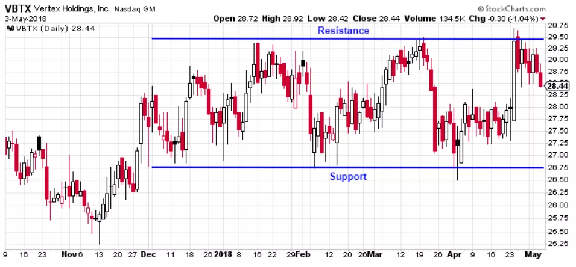
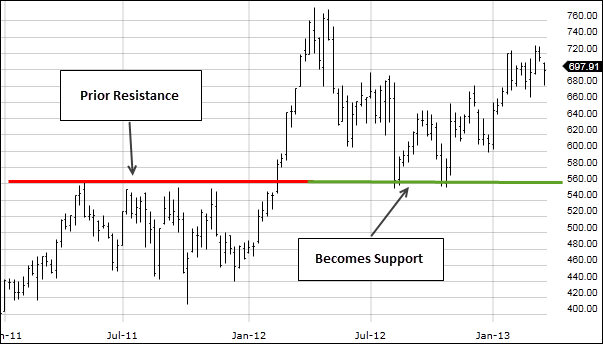
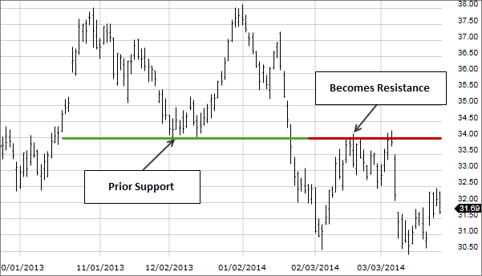
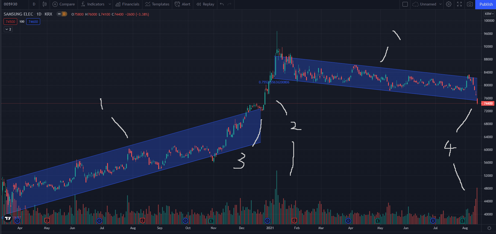
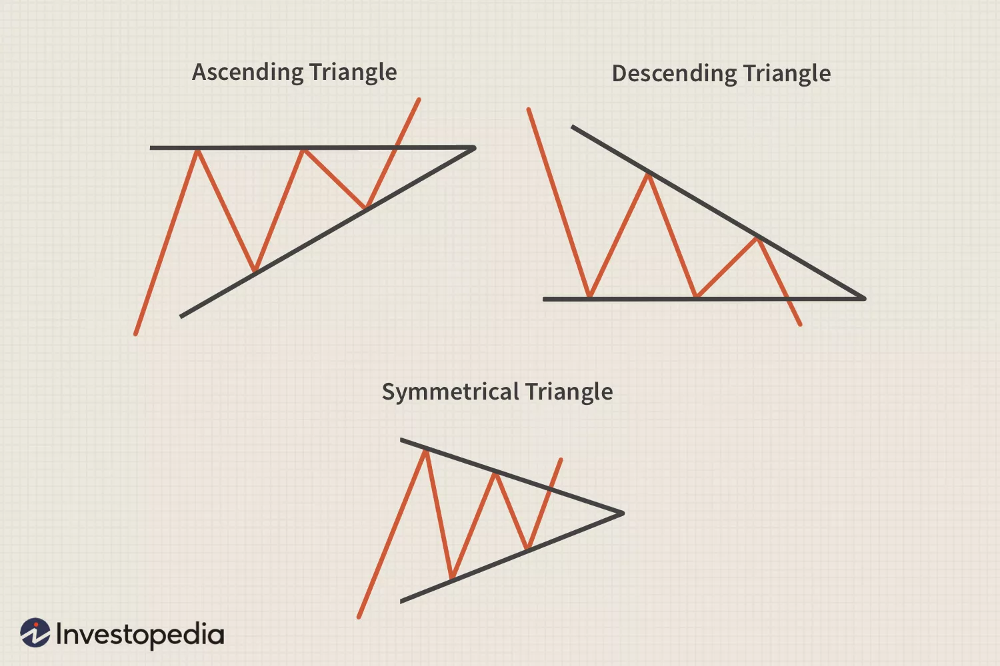

## 서론

평소 나는 차트만 봐선 이해 할 수 없는 것들이 많다고 말하고 다니곤 했다. 그 말은 차트를 맹신하지 않았으면 하는 바람에서 나온 말이지만 반대로 차트를 보고 정보를 얻었으면 하는 바람이 크다. 차트에는 분명한 사실이 존재하고 이를 통해 유추해볼 수 있는 정보가 있다. 그 중 제일 대표적인 것은 지지와 저항이다. 

차트에는 시간, 가격, 거래량 정보가 있다. 누군가는 어떤 시점에서 어떤 가격에 주식을 팔고 누군가는 어떤 시점에서 어떤 가격에 주식을 산다. 사고 파는 이유는 알 수 없지만 사고 팔았다는 이 정보는 분명한 사실이다. 

## Basic

### 정의
지지와 저항은 가격이 한 방향으로 움직이는 것을 멈추거나 방향이 바뀔 가능성이 있는 가격대를 지칭한다. 이는 주요 시점, 지점에서 매수자나 매도자가 몰리기때문에 생겨나게 된다.

*Support and Resistance*

## Advanced

### Bounces or Breakouts

가격이 지지나 저항을 만날때 일어날 수 있는 일은 두 가지중 하나다. 

- 지지나 저항을 만나 통과하지 못하고 반대 방향으로 되돌아감 (Bounce)

- 지지나 저항을 만나 통과하고 다음 지지나 저항을 만나거나 형성함 (Breakout)

### Breakout

*Breakout*

지지나 저항을 통과하는 것을 Breakout이라고 부른다. Breakout은 대부분의 경우 평소보다 많은 거래량을 동반한다. 보편적으로 기술적분석[^1]  [^2]에선 Breakout이 일어난 방향으로 앞으로의 추세가 시작될 것이라고 해석한다. 

여담으로 위의 그림에선 Breakout 전에 삼각형 모양으로 저항의 가격대가 수렴(Convergence)하는 모습도 볼 수 있는데 이를 Triangle Pattern이라고 부른다. 가격이 수렴할수록 가격변화(Breakout)가 임박했다는 뜻으로 해석한다. 삼각형의 모양[^3] 을 보고 상승이냐 하락이냐를 유추하는 지표로 쓰기도 한다.

### Reversal

Breakout이 일어난 이후 지지나 저항은 역할이 역전되는 모습을 자주 보인다.

- 저항을 통과한 후 저항이 지지로 작용

*Resistance becoming support*

- 지지를 통과한 후 지지가 저항으로 작용

*Support becoming resistance*

## In The Real World

*삼성전자 2020/03 ~ 2021/08*

위의 차트는 2020년 3월 말부터 2021년 8월 중순까지 삼성전자 1 Day 차트이다. 

1. 파란색 박스[^4]안에서 지지와 저항을 확인할 수 있다. 

2. 2020년 12월과 2021년 1월 사이에서 Breakout을 확인할 수 있다. 

3. 2020년 3월부터 작용했던 저항(50,000~ 72,000)은 Breakout 이후 지지로 작용하였다. (Reversal)

5. 2021년 8월 많은 거래량을 동반하며 지지를 Breakout하려는 모습을 보인다. (앞으로 삼성전자의 주가는 어떻게 될까?)

## 결론

우리가 사는 세상에 절대적인 것은 없다. 지지와 저항도 마찬가지다. 하지만 지지와 저항은 단기적인[^5] 가격 범위를 유추하거나 진입/탈출시점을 정하는데 좋은 실마리가 될 수 있다고 생각한다.

------
[^1]: 기술적 분석(技術的 分析, 영어: technical analysis)은 주식 시장을 비롯한 금융 시장을 분석하고 예측하는 기법 가운데 하나다. 주로 시세 동향 그래프(차트)를 이용해 분석한다. 기본적 분석[^2]과 대비되는 분석 기법이다. 

[^2]: 기본적 분석(基本的 分析, 영어: fundamental analysis)은 기업의 재무제표, 건전성, 경영, 경쟁우위성, 경쟁상대, 시장 등을 분석하는 것이다.

[^3]: 

[^4]: 트레이딩뷰 차트툴 Trend의 Regression Trend 이용. 기간을 선택하면 자동으로 가격대 박스를 그려줌

[^5]: 여기서 단기적이라는 표현은 차트상에 표시되는 상대적 기간을 말한다. 차트의 Interval이 주, 월, 년단위라면 먼 시점의 가격 범위를 유추해볼 수 있다.

## 자료 출처

- https://www.investopedia.com/trading/support-and-resistance-basics/
- https://www.fidelity.com/learning-center/trading-investing/technical-analysis/support-and-resistance
